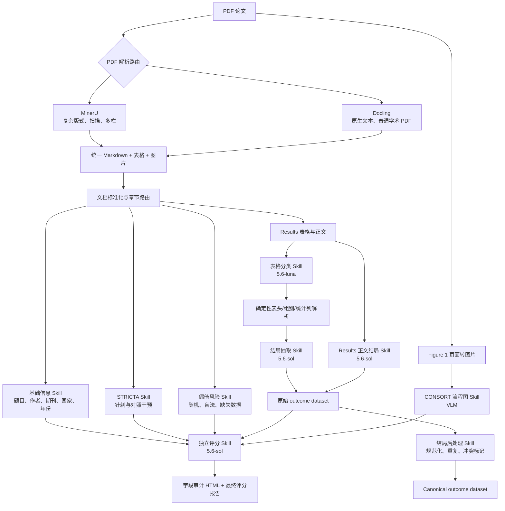

# Article Agent 当前全流程与各 Skill 功能说明

> 更新时间：2026-09-01  
> 当前主流程：无截断、逐表逐行、原始值优先、冲突保留  
> 最新复评标签：`lossless_sol_v6_full`

## 1. 一句话理解整个系统

系统先把 PDF 还原成可定位的正文、表格和图片，再把不同章节送给不同的医学信息抽取 Skill；统计结局采用“先理解表格类型、再解析表头、最后逐行抽取”的方式。抽取完成后只增加规范化和冲突标记，不修改论文原始值，最后再由独立 LLM 对抽取质量评分。

## 2. 当前全流程



## 3. 每个阶段在做什么

### 第一步：PDF 解析和版式还原

输入是原始 PDF。

- 先用 PyMuPDF 检查文字层是否完整、编码是否健康、是否存在复杂多栏或扫描页面。
- 普通原生 PDF 可交给 Docling。
- 复杂多栏、扫描件或布局困难的 PDF 优先交给 MinerU。
- 解析后生成 Markdown、表格结构、页面图片、区块坐标和阅读顺序。
- 如果第三方解析器不可用，可以显式回退到 PyMuPDF，但输出会标明回退，不伪装成 MinerU/Docling 结果。

主要输出：

- `article.md`：论文 Markdown。
- `normalized_document.json`：统一的正文、表格和版式结构。
- `pdf_text_layer.json`：PDF 文字层审计。
- `figure-1-page.png`：用于流程图识别的页面图片。

### 第二步：章节路由

系统按用途分配上下文，避免每个 Skill 都读取整篇论文：

- 基础信息：题目、摘要、Introduction 和文献头信息。
- 针刺/干预：Methods 中的 intervention、control、treatment 等段落。
- 偏倚风险：Methods 中的 randomization、blinding、analysis 和 missing data 段落。
- 统计结局：完整 Results、表格和相关结果正文。
- CONSORT：Figure 1 图片以及可用于交叉核对的正文数字。

当前路由不再使用字符窗口截断。`routed_context.json` 可以检查每个模块实际收到的文本。

### 第三步：分模块结构化抽取

基础信息、针灸干预和偏倚风险分别调用自己的 Skill。每个 Skill 都使用同一种四段式提示词：

1. `ROLE_DEFINITION`：医学 RCT 论文信息提取专家。
2. `TASK_DESCRIPTION`：本模块具体要做什么。
3. `FIELD_BOUNDARIES`：每个字段的含义、枚举和禁止事项。
4. `JSON_TEMPLATE`：必须返回的 JSON 结构。

结果必须通过 Pydantic 校验，并与 Excel 字段注册表对应。没有直接证据时填 `NR` 或“未报告”，不能凭医学常识补全。

### 第四步：统计结局的表格处理

统计结局不是直接把整篇 Results 丢给一个模型，而是分为三层。

#### 4.1 表格语义分类

`gpt-5.6-luna` 阅读完整表格和相关 Results 文字，将表格判断为：

- `outcome`：临床结局。
- `safety`：不良事件。
- `subgroup`：亚组分析。
- `sensitivity`：敏感性分析。
- `baseline`：基线资料。
- `flow`：受试者流程。
- `other/unknown`：其他或暂不确定。

这里不再使用 “Pain”“VAS” 等关键词硬匹配，因此类似 2015-05 Table 2 的表格不会只因标题表达不同而被遗漏。

#### 4.2 确定性结构解析

这一步由 Python 完成，不让 LLM 猜表格坐标。

- 合并多级表头和重复表头。
- 为每列生成 `column_map`。
- 识别列对应的 arm、时间点、统计类型、分析集和样本量。
- 保存每个原始单元格、列号、表头路径和坐标。
- 为每一行生成稳定的 `table_id` 和 `row_id`。

例如一列不会只保存“4 weeks”，而是保存类似：

```json
{
  "header_path": ["Acupuncture group Mean(SD)", "4 weeks after treatment"],
  "arm_label": "Acupuncture group",
  "timepoint_raw": "4 weeks after treatment",
  "statistic": "mean_sd"
}
```

#### 4.3 结局语义抽取

`gpt-5.6-sol` 负责模型更擅长的语义判断：

- 结局名称和量表名称。
- 时间点的临床含义。
- 哪些组正在比较。
- ITT、PP、FAS、敏感性分析等分析集。
- primary、secondary、safety 等记录角色。
- P 值对应哪个比较关系。

重要规则：

- 每个 `outcome × timepoint × analysis_set × comparison` 单独生成记录。
- 所有研究臂都保留，不能只压缩成一个干预组和一个对照组。
- 数值只能来自当前行、当前表头映射和当前 Results 证据。
- 允许证据唯一支持、可重复计算的推导，并写明 `derived` 和 `derivation`。
- 禁止猜测、跨表借值、跨时间点借值或依据 Gold 修改结果。
- 不存在“全篇最多 6 条”的限制。

请求首先尝试完整表格。如果响应超时、JSON 不完整或遗漏任意 `row_id`，系统自动按完整行块或单行重试。每个请求及覆盖结果写入 `request_manifest.jsonl`，不能静默丢行。

### 第五步：Results 正文结局抽取

有些主要结局只写在 Results 段落中，没有完整进入表格。正文结局 Skill 会：

- 扫描完整 Results 正文。
- 为每个段落建立稳定的 `narrative-results:rXXX` ID。
- 提取正文明确报告的结局、时间点、组别和数值。
- 与表格内容重复时保留两份原始记录，并在后处理阶段归入同一冲突组。

正文不能替表格补写未出现的组别或数值。

### 第六步：CONSORT 流程图识别

流程图 Skill 直接读取 Figure 1 图片，识别：

- screened：筛选人数。
- excluded：排除人数及原因。
- randomized：随机人数。
- allocated/received：分配和实际接受治疗人数。
- follow-up：随访人数。
- analyzed：最终分析人数。
- dropout：明确写出的退出人数及原因。

阶段性 missing follow-up 不能简单累加成总脱落。模糊数字不猜测，保留为未确定，并与正文和表格数字交叉核对。

### 第七步：结局后处理和冲突管理

结局抽取完成后，`gpt-5.6-sol` 进行独立后处理。它只做注释，不修改原始记录。

可以增加：

- 规范化结局名、量表名和时间点。
- 重复记录组。
- `conflict_group_id`。
- 与 Gold 的 `none/conflict/unresolved/not_checked` 标记。

不能修改：

- `source_outcome`。
- 原始 arm、n、数值、CI、P 值。
- 原文证据。

当规范化值与原始值冲突时，评分和导出优先使用原始值。Gold 只在抽取完成后参与比较，不能反向修正抽取结果。

### 第八步：Canonical outcome dataset

`outcomes.canonical.json` 是便于分析和导出的规范视图，不是新的事实来源。

- 原始重复记录仍保留在 `extraction.json`。
- 完全一致的来源可以指向一个 canonical 代表行。
- 值不一致的来源进入 `conflict_groups`。
- canonical 记录通过 `source_indices` 回指全部原始来源。
- `gold_used=false`，表示 canonical 数据不依据 Gold 改值。

### 第九步：独立复评和 HTML 审计

评分与抽取是两个独立步骤，评分模型当前固定为 `gpt-5.6-sol`。

- 基础信息、针灸、偏倚、结局、CONSORT 分开评分。
- 结局评分读取全部原始记录、全部证据和全部 Gold 行。
- 最新复评按最多 16 条记录组成一个完整行块，串行发送。
- 响应必须完整返回行块内全部 `source_index`，否则不接受并进入回退。
- 每篇结局分是所有 `source_index` 分数的确定性平均；漏评记录按 0 处理，不能只算成功的前几条。
- 最终生成逐字段审计 HTML 和六篇汇总报告。

## 4. 各 Skill 的简单说明

| Skill | 主要输入 | 它负责什么 | 它不负责什么 | 主要输出 |
|---|---|---|---|---|
| PDF 解析 Skill | PDF | 还原正文、表格、图片和阅读顺序 | 不判断医学字段 | `article.md`、`normalized_document.json` |
| 章节路由 Skill | 标准化文档 | 把相关章节送给正确模块 | 不抽取最终值 | `routed_context.json` |
| 基础信息 Skill | 标题、摘要、Introduction、DOI | 标题、作者、期刊、国家、年份、干预和对照 | 不读取 Results 数值 | `metadata` |
| STRICTA 针刺 Skill | Methods | 针型、穴位、频次、疗程、得气、刺激方式、假针类型 | 不评价疗效 | `acupuncture` |
| 偏倚风险 Skill | Methods | 随机、分配隐藏、盲法、主要分析和缺失数据方法 | 不根据结局显著性反推方法 | `risk_of_bias` |
| 表格分类 Skill | 完整表格和 Results | 判断表格属于 outcome、baseline、safety 等 | 不抽取最终数值 | 表格类别和选择理由 |
| 表格结构解析器 | 表格 HTML/Markdown | 建立多级表头、列映射、arm、时间点和单元格坐标 | 不做临床语义猜测 | `column_map`、稳定行 ID |
| 结局抽取 Skill | 当前表格、行、完整表头 | 识别结局、时间点、比较、分析集并绑定原始数值 | 不使用 Gold，不跨行借值 | 原始 outcome records |
| Results 正文 Skill | Results 段落 | 补充只在正文报告的主要/次要结局 | 不用正文替表格补未知数值 | narrative outcome records |
| CONSORT VLM Skill | Figure 1 图片 | 提取筛选、随机、分组、随访、分析和脱落人数 | 不猜模糊数字 | `consort_flow.json` |
| 后处理 Skill | 原始 outcome、证据、Gold | 增加规范化、重复和冲突注释 | 不改原始值 | `outcomes.postprocessed.json` |
| Canonical Skill | 原始记录和后处理注释 | 建立代表记录和冲突组 | 不裁决未解决冲突 | `outcomes.canonical.json` |
| 评分 Skill | 抽取结果、证据、Gold | 独立评价每个字段和每条结局 | 不参与抽取或改值 | `llm_evaluation.*.json` |
| QA/报告 Skill | manifests、抽取和评分结果 | 检查覆盖、哈希、旧缓存和生成 HTML | 不替系统补数据 | `LOSSLESS_QA.html`、`FINAL_SCORE_REPORT.html` |

## 5. LLM、Python 和 Gold 的分工

| 参与者 | 最适合做什么 | 当前规则 |
|---|---|---|
| `gpt-5.6-luna` | 快速语义路由、表格分类、轻量判断 | 不替代主要字段抽取模型 |
| `gpt-5.6-sol` | 医学字段抽取、结局语义、后处理和独立评分 | 必须服从证据、Pydantic 和覆盖校验 |
| 确定性 Python | 表头、坐标、数值列、哈希、覆盖、合并和聚合 | 不猜医学语义 |
| Pydantic/BAML runtime | JSON 结构校验、枚举和自动重试接口 | 当前可使用 BAML；未配置生成客户端时回退到 OpenAI-compatible + Pydantic |
| Gold Excel | 最终评分和冲突标记 | 不能进入原始抽取请求，不能反向修改论文值 |

## 6. 四种结局数据不要混淆

1. **原始数据**：`extraction.json` 中的 outcomes。它是事实层，必须保留。
2. **后处理数据**：`outcomes.postprocessed.json`。它是注释层，不能覆盖原始数据。
3. **Canonical 数据**：`outcomes.canonical.json`。它是便于使用的代表视图，冲突仍保留。
4. **Gold 数据**：人工 Excel。只用于评分和标记冲突，不是抽取输入。

## 7. 当前最重要的质量保护

- 不截断完整章节、表格、Gold 或证据文本。
- 不限制全篇结局条数。
- 每个目标行必须有明确覆盖状态。
- 每个请求保存 `input_sha256`、`row_id`、状态和重试原因。
- 整表响应遗漏任意行就进入回退，不能部分接受。
- 原始记录数量必须与评分输入数量一致。
- 冲突和重复不删除，只分组。
- 允许可复现推导，禁止猜测。
- 旧缓存的输入哈希或记录数不匹配时不能作为新评分。
- API 请求串行执行，每次请求前等待 10 ms，并支持 base URL 故障切换。

## 8. 最新运行状态

最新六篇复评使用 `gpt-5.6-sol` 和标签 `lossless_sol_v6_full`：

- 原始结局记录：436 条。
- 已评分：436 条。
- 缺失 `source_index`：0。
- 结局平均分：60.50。
- 综合平均分：70.67。
- 测试：190 项通过。

当前仍需处理的不是“漏评”，而是以下抽取/后处理问题：

- 2015-01～05 的后处理文件仍只覆盖新增结局之前的旧记录数，需要重新完成后处理。
- 2015-06 的 `narrative-results:r006` 仍在抽取覆盖 QA 中标记为未覆盖。
- 2015-06 结局虽然 12/12 条都完成评分，但字段结构质量较低，结局分仅为 4。
- 2015-03～05 的 CONSORT 抽取为 0 分，需要重新识别流程图或核查图片页。

因此，目前可以认为“无损复评已完成”，但不能认为“全部抽取和后处理质量已经验收通过”。

## 9. 最常查看的文件

| 文件 | 用途 |
|---|---|
| `extraction.json` | 查看所有原始抽取结果 |
| `routed_context.json` | 查看各 Skill 实际收到的章节 |
| `raw_module_responses/request_manifest.jsonl` | 检查结局请求、行覆盖和重试 |
| `raw_module_responses/outcomes.tablewise.manifest.json` | 检查表格分类、表头和行选择 |
| `outcomes.postprocessed.json` | 查看规范化和 Gold 冲突注释 |
| `outcomes.canonical.json` | 查看 canonical 代表记录和冲突组 |
| `FIELD_AUDIT.lossless_sol_v6_full.html` | 查看单篇字段对错 |
| `FINAL_SCORE_REPORT.html` | 查看六篇最新复评汇总 |
| `LOSSLESS_QA.html` | 查看覆盖、缓存和来源完整性问题 |

